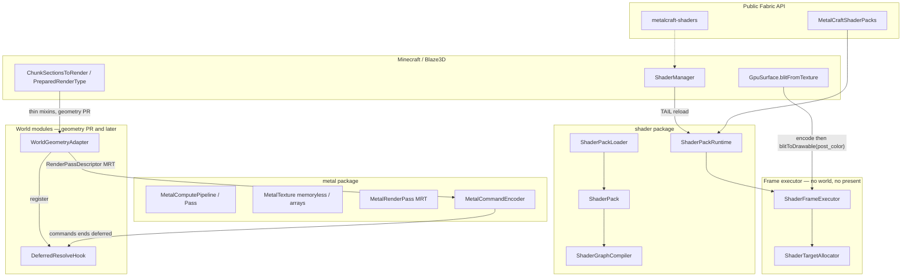
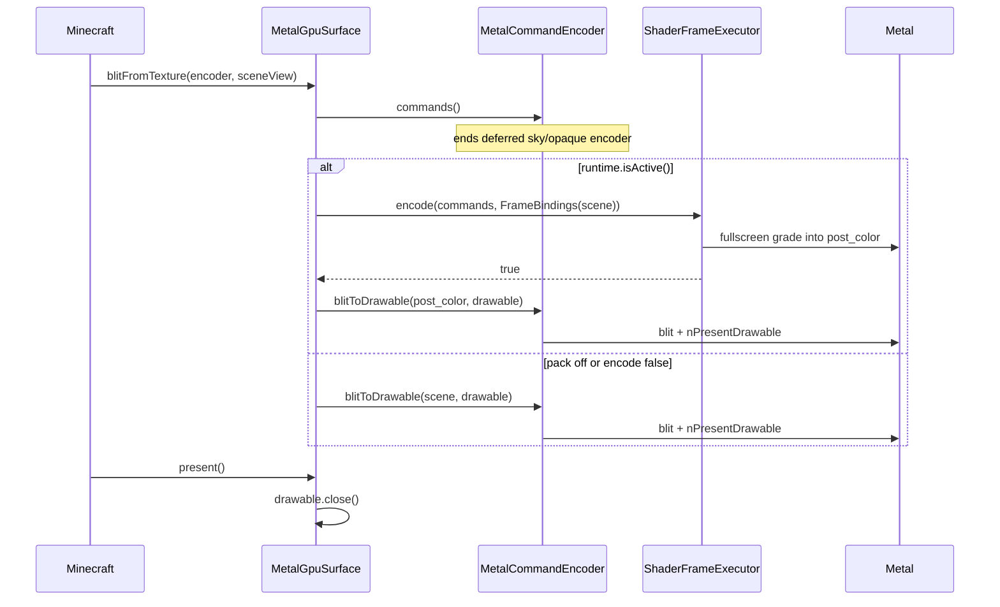

# Metal-Native Shader Engine for MetalCraft

| Field | Value |
| --- | --- |
| **Title** | Metal-Native Shader Engine |
| **Author** | MetalCraft contributors |
| **Date** | 2026-09-03 |
| **Status** | In progress; PR 0–4 complete; PR 5 cascade fitting in progress |
| **Target** | Minecraft Java 26.2, Fabric, macOS arm64, direct Metal backend |
| **Parent commit of deleted engine** | `a7c274a` |
| **Deletion commit** | `0eb8833 Remove the shader pack engine and leave the Metal backend` |

---

## Implementation review — 2026-09-04

Git checkpoint: `f695385` implemented the foundation (PR 0–2); `fe99c7c`
added the world adapter and memoryless resolve (PR 4). PR 3 is optional.
The capability table below describes the deletion checkpoint, not current HEAD.

Completed PR 4 correctness work (working tree, following `fe99c7c`):

- [x] The merged resolve needs the **geometry attachment indices**, not just its own
  `writes` list. The runtime now supplies those indices to its compile unit.
- [x] Normal rendering must preserve geometry's shaded `scene` until the lighting module
  handles RGB lightmap sampling, fog, overlays, and emissive surfaces. Taking the maximum
  of the two UV2 levels loses all of these. Debug views still exercise framebuffer fetch.
- [x] Geometry PSOs must successfully compile **before** routing a pass into the G-buffer.
  Resolve compilation failure falls back to forward geometry until reload. Recompile
  options rebuild the world adapter, and resize releases its old resolve PSO.
- [x] Allocation-only coverage is insufficient. The smoke now compiles/substitutes real
  terrain, draws deterministic MRT pixels through the adapter, runs the production
  deferred hook, and checks both shaded-scene preservation and albedo debug readback.
  It uses a standalone public pass wrapper because no global RenderSystem is initialized.
  Consecutive half-screen draws now also verify that resolve resets the geometry scissor.
  Both `-PmetalPassMerging=true` and `false` pass the GPU readback checks.

Plan corrections for the remaining work:

1. **PR 5 needs the binding contract originally postponed to PR 7.** Cascade matrices,
   camera transforms, and the depth-array sampler must reach resolve before shadows can
   be sampled. Define and test these named bindings in PR 5; PR 7 consumes them. Verify
   coordinate spaces, depth reconstruction, and off-camera caster coverage before GGX.
2. **A disabled compute node must write a defined result.** An early return without writing
   leaves downstream reads undefined. Keep dispatches in the graph but write the neutral
   value (AO = 1, additive bloom = 0) or copy the input, according to the node's contract.
   PR 6 also needs executor dispatch/binding support; the current executor only runs
   non-merged fullscreen passes.
3. **Resolve scene lifetime and post-processing placement explicitly.** Depth effects need
   a stored/sampleable depth binding; memoryless G-buffer channels cannot survive into a
   compute encoder. Present-time grading also affects the GUI, so define a world-only
   insertion point before shipping effects that should exclude HUD/text.

- [x] Merged versus forced-split world passes, with identical expected GPU pixels.
- [x] In-game reload/resize/pack-failure run — passed on 2026-09-04; the harness restores
  the original pack selection. The captured world screenshot was visually inspected.
  Creative inventory/search validation also passed.
- [x] Full `gradle build --offline` including shader and cascade smoke tests.

Validation commands:

```sh
gradle shaderTranslationSmoke --offline
gradle shaderTranslationSmoke --offline -PmetalPassMerging=false
gradle runClient --offline -PmetalLifecycleTest -PmetalShaderLifecycleTest=true
```

Continue PR 5's binding and caster-rendering work, then PR 7 lighting;
PR 6 effects can follow once their depth inputs and neutral outputs are defined.

---

## Overview

MetalCraft already draws a 26.2 world through a direct Metal backend: Blaze3D → Java adapters → JNI/`src/native/metalcraft.m` → `Metal.framework`. Vanilla GLSL continues to reach the GPU via `MetalShaderTranslator` (shaderc GLSL → SPIR-V → SPIRV-Cross MSL 2.4). What is missing is a **Metal-native shader pack engine**: a versioned JSON graph plus first-party MSL that can replace the world's lighting and post-process without rewriting Java for every visual change.

The previous engine at `a7c274a` proved the graphics ideas — memoryless G-buffer, `merge_with` tile-memory resolve, layered shadow maps, compute bloom/SSAO, first-party GGX — and then collapsed them into one 1,387-line `MetalShaderEngine` plus 600-line mixins. Commit `0eb8833` deleted ~14,078 lines so this design can start from the renderer alone. This document keeps the capabilities and changes the seams.

The foundation ships as a **deep module**: a small interface (immutable pack + compiled graph + frame executor) with a large implementation (graph analysis, TBDR load/store, PSO compilation, failure isolation). Visual iteration lives in `pack.json` and `.metal` files. Java changes only when the *contract* changes. If a pack fails to compile, the client keeps rendering on the vanilla Metal path.

---

## Background & Motivation

### Why this change is needed

Minecraft's built-in shading is a forward renderer with a 4-bit lightmap, no cascaded shadows, and a tiny post-process graph (Fabulous translucency, glowing outlines, spectator vision). Players expect deferred PBR, shadows, SSAO, bloom, volumetrics, and a tonemapper. On Apple silicon the cost of getting there the OptiFine way is the wrong architecture: many full-size load/store round-trips through system memory on a TBDR GPU whose fast path is tile memory.

MetalCraft is already the Metal device. The open Milestone 3 items in `ROADMAP.md` are exactly the missing product surface: an example full-screen pass, per-extension error isolation, and a versioned post-processing graph. The deleted engine attempted all three and more, then mixed them with world substitution and lighting so thoroughly that every new effect touched Java + mixins + MSL + `MetalShaderEngine`.

### Traditional Minecraft shader methods

**OptiFine / ShadersMod pack format.** A pack is a folder of GLSL files with fixed program names, not a declared graph. Programs run in a fixed order: `setup` (Iris compute) → `begin` → `shadow` → `shadowcomp` → `prepare` → opaque `gbuffers_*` → `deferred` → translucent `gbuffers_*` → `composite` → `final`. Gbuffers-style programs draw world geometry (`gbuffers_terrain`, `gbuffers_entities`, `gbuffers_water`, …) with a documented fallback chain (`gbuffers_terrain` ← `gbuffers_textured_lit` ← `gbuffers_textured` ← `gbuffers_basic`). Composite-style programs draw a fullscreen quad and ping-pong `colortexN` attachments. Configuration is `shaders.properties` plus `const int colortexNFormat = RGBA16F;` comment directives. Uniforms are a large, implicit set (`gbufferModelView`, `shadowLightPosition`, `heldItemId`, …). Primary references: [Iris program overview](https://shaders.properties/current/reference/programs/overview/), [Iris gbuffers table](https://shaders.properties/current/reference/programs/gbuffers/), [shaderLABS rendering pipeline](https://shaderlabs.org/index.php?title=Rendering_Pipeline_(OptiFine,_ShadersMod)), [IrisShaders/ShaderDoc](https://github.com/IrisShaders/ShaderDoc).

**Iris** is the Fabric implementation of that contract, built to load existing OptiFine packs beside Sodium. Its own README states the goal as backwards compatibility with ShadersMod/OptiFine packs and calls out Canvas as a *different* format that cannot run those packs. The pipeline is OpenGL-centric: `gl_FragData`, legacy attributes (`gl_MultiTexCoord0`, `ftransform()`), `colortex` flip semantics, SSBOs, image load/store, and `shaders.properties` feature flags (`COMPUTE_SHADERS`, `SSBO`, `CUSTOM_IMAGES`). Iris on 26.x still lives in that GL world; MetalCraft's Metal path never initializes OpenGL or MoltenVK. Porting Iris packs is a translation of an OpenGL frame graph onto Metal, not a way to exploit Apple GPUs.

**Vanilla 26.2 core shaders and post-process.** In this workspace's mapped sources (`minecraft-clientOnly-043a8b3edf-26.2-sources.jar`):

- `net.minecraft.client.renderer.ShaderManager` is a `SimplePreparableReloadListener`. `prepare` loads every `shaders/**` GLSL file (with `#moj_import`) and every `post_effect/*.json` chain. `apply` precompiles `RenderPipelines.getStaticPipelines()` through `GpuDevice.precompilePipeline`. Failure of a *required* pipeline throws and trips recovery.
- Core programs are no longer JSON. They are in-code `RenderPipeline` objects. `RenderPipelines.TERRAIN_SNIPPET` uses `core/terrain`; `ENTITY_SNIPPET` uses `core/entity`; block entities use `core/block`. Those three vertex formats are the world-geometry surface a pack must stand in for.
- `PostChain` / `PostChainConfig` still describe a small fullscreen graph (Fabulous, entity outline, spectator effects) with named targets and `RenderPipelines.POST_PROCESSING_SNIPPET`. This is not a world shader system.

MetalCraft already translates those core GLSL programs to MSL and runs them. The pack engine is **additive**: vanilla core shaders keep flowing through `MetalShaderTranslator`; a pack intercepts world draws and/or composites after them.

**Canvas Renderer (grondag / vram-guild).** Canvas is a Fabric renderer that implements FREX and replaces vanilla world rendering with a material/pipeline shader system. Packs are resource-pack assets (`materials/*.json` pointing at `shaders/*.vert|frag`), not OptiFine programs. Canvas's README is explicit: it is for *mod authors*, it does not load OptiFine packs, and it is mutually exclusive with Sodium/Iris. That is the right *kind* of contract (declared materials + first-party shading language) and the wrong *backend* (OpenGL, not Metal; not 26.2 Blaze3D).

**Sodium + Iris vs a custom backend.** Sodium is a mesh/raster optimizer in front of OpenGL. Iris is a shader loader on top of that. MetalCraft *is* the backend: it already owns `MTLDevice`, the command encoder, pass merging, and MSL translation. Sitting Iris on Metal would mean reimplementing Iris's GL state machine on Metal, then translating every popular pack's GLSL. That is a multi-year compatibility project. It is not how you get a high-quality Apple-silicon look.

**Why SPIRV-Cross of OptiFine GLSL is the wrong v1.** MetalCraft already uses SPIRV-Cross for *vanilla* GLSL, and that is the right compatibility path for Blaze3D programs: one flattened resource-slot ABI, explicit locations, Vulkan Y-flip. OptiFine packs are a different language. They assume:

- multiple draw buffers with `colortex` ping-pong and `flip.<program>.<buffer>`
- legacy GL attributes and `gl_FragData[n]`
- shadow hardware as `sampler2DShadow` with `textureGrad` (macOS `sample_compare` does not accept gradients; SPIRV-Cross has an open history of emitting illegal MSL here)
- separate shadow/composite/deferred *passes* that each load and store full-resolution attachments

Apple's TBDR GPU wants the opposite: keep the G-buffer in tile memory, resolve lighting before the encoder ends, and only store what a later pass samples. A translated OptiFine pack would store every `colortex` to device memory and reload it, paying the bandwidth the architecture exists to avoid. SPIRV-Cross can emit MSL that *runs*; it cannot emit a TBDR frame graph the author never wrote. That is a compatibility project, not a quality/performance project on Apple GPUs.

### Apple silicon / Metal (primary sources)

Apple GPUs are tile-based deferred renderers with unified memory. Relevant first-party guidance:

- [Choosing a resource storage mode for Apple GPUs](https://developer.apple.com/documentation/metal/choosing-a-resource-storage-mode-for-apple-gpus): `shared` for CPU-updated data, `private` for GPU-owned resources, `memoryless` for textures that live only in tile memory.
- [`MTLStorageMode.memoryless`](https://developer.apple.com/documentation/metal/mtlstoragemode/memoryless): memoryless textures cannot use `Load` or `Store`; they exist for the encoder lifetime.
- [Tailor your apps for Apple GPUs and TBDR](https://developer.apple.com/documentation/metal/tailor-your-apps-for-apple-gpus-and-tile-based-deferred-rendering): imageblocks are structured tile memory; fragment shaders see the current pixel; tile shaders / compute can see the whole tile. Programmable blending (`[[color(n)]]` as a fragment *input*) reads the previous draw's output from tile memory.
- [WWDC 2020 10632 — Optimize Metal Performance for Apple silicon Macs](https://developer.apple.com/videos/play/wwdc2020/10632/): merge compatible passes; set load/store correctly; put G-buffer albedo/normal/roughness in memoryless attachments with `storeAction = .dontCare` and store only the lighting texture. Their tiled-deferred sample is the pack graph we want: geometry + lighting in one encoder.
- [Improving CPU performance by using argument buffers](https://developer.apple.com/documentation/metal/improving-cpu-performance-by-using-argument-buffers): bind groups of resources in one encoder call. Ranked item 5 in `docs/APPLE_SILICON_PERFORMANCE.md`; **not** the ABI or pack PR.
- Binary archives / PSO caching: [Creating binary archives](https://developer.apple.com/documentation/metal/creating-binary-archives-from-device-built-pipeline-state-objects). Ranked item 4; restore `MetalPipelineCache` after the graph runs, not before.

This repo's `docs/APPLE_SILICON_PERFORMANCE.md` already records the local consequences: unified memory, pass merging in `MetalCommandEncoder`, stage-boundary-only GPU counters on the tested M4 Max, 8–10% run-to-run spread, compositor pacing that invalidates naive A/B. New GPU work is ranked with `MetalPassCensus` labels. Do not claim FPS.

### What the live tree actually has

| Capability | Status at HEAD (`0eb8833`) |
| --- | --- |
| Vanilla GLSL → MSL pipelines | Yes. `MetalShaderTranslator`, `MetalRenderPipeline.GlslDescriptor` |
| Native MSL pipelines | Yes. `MetalRenderPipeline.Descriptor` already allows **1–8 color formats** on the PSO; the *pass* cannot begin with more than one |
| Compute pipelines / dispatches | **Gone.** `MCObjectType` jumps 9 → 11 (Fence=11 … TimestampQueryPool=14). At `a7c274a` compute was 15/16 |
| Color attachments per pass | **One.** `MetalCommandEncoder.createRenderPass` rejects `size() != 1`; `nBeginRenderPass` takes a single handle |
| Texture arrays | **Rejected in three places:** `MetalTexture.Descriptor` requires `depthOrLayers == 1` unless cubemap; `MetalGpuDevice.createTexture` throws `UnsupportedOperationException` for arrays; native `nCreateTexture` only emits `MTLTextureType2D` / Cube |
| Texture views | `nCreateTextureView` uses `sliceCount = cubemap ? 6 : 1`. A 2D array view would cover one layer |
| Memoryless storage | **Gone.** `nCreateTexture` always `MTLStorageModePrivate` |
| Layered render (`renderTargetArrayLength`) | **Gone** |
| Pass merging (sky + opaque) | Yes. `MetalCommandEncoder.canMerge` requires continuing `LOAD`/`STORE`. `-PmetalPassMerging` maps to `metalcraft.passMerging` |
| Command batching | Yes. `drawMultipleIndexed` → `MetalCommandStream` |
| `MetalPassCensus.kindFor` | Yes. Native table is **32** kinds (`MC_GPU_PASS_KINDS`). Java reports at most 12 named spans plus `sumOfSpans` |
| `metalcraft-shaders` entrypoint | Yes. Pipeline registration only; nothing draws. `MetalCraftClient.initializeRendererExtensions` has **no** per-extension try/catch |
| `ShaderManagerMixin` tail | Yes. Recompiles registered Blaze3D pipelines on resource reload |
| Options GUI | Half-resolution + unlocked frame rate. No pack selector |
| Shader pack runtime | **Gone** |
| Present path | `MetalGpuSurface.blitFromTexture` → `MetalCommandEncoder.blitToDrawable` (blit + `nPresentDrawable`). Minecraft then calls `present()`, which only `drawable.close()` |

### Why the deleted engine cannot be restored as-is

`MetalShaderEngine` (1,387 lines) loaded packs, compiled graphs, allocated targets, encoded geometry/shadow/post, owned `MetalWorldGeometry` / `MetalWorldLighting` / `MetalWorldShadow`, wrote `config/metalcraft-shaders.json`, and exposed a dozen statics (`active()`, `resolveOpaque()`, `publishLocalLights()`, `isLayeredShadowAttachment()`, …) that mixins called. That is a shallow mega-module.

Do **not** `git checkout a7c274a` the engine, mixins, lighting, occupancy, MetalFX, or `topologyClass` on `nCreateRenderPipeline`. Copy only the capabilities listed in the ABI appendix, with the denylist in Key Decision 11.

The deletion test on `ShaderGraphCompiler`: if we deleted it, every caller would re-implement producer/consumer analysis, `merge_with` grouping, memoryless eligibility, and load/store. It earns its keep. The deletion test on `MetalShaderEngine`: callers already *were* the engine. It does not.

---

## Goals & Non-Goals

### Goals

1. A versioned first-party Metal pack format (JSON graph + `.metal` sources) that an engineer can iterate by editing MSL and a manifest.
2. A frame executor that, given a compiled graph and host-supplied `scene`, encodes GPU work with no world knowledge and does not present.
3. TBDR-first execution once geometry exists: memoryless G-buffer when resolve merges into the geometry encoder; `DontCare` store for dead attachments; layered shadow maps in one encoder; compute for full-screen filters.
4. Failure isolation: a bad pack or a failed pass compile disables the pack, logs diagnostics, and leaves vanilla Metal rendering intact. The client does not crash.
5. Measurement: every new pack pass is labeled for `MetalPassCensus`; no FPS claims; existing flags remain.
6. A first-party pack whose *eventual* look is deferred GGX on the vanilla lightmap, cascaded sun shadows, SSAO, bloom, ACES, volumetrics, and SMAA — landed as incremental pack nodes. Occupancy/point lights and TAA are later experiments, not the lighting or foundation AA path. Never MetalFX.
7. GUI: pack selector + generated option widgets, persisted at `config/metalcraft-shaders.json`. Default selected pack is `none`.

### Non-goals (foundation)

- Do not replace Blaze3D with a parallel renderer.
- Do not call private Apple APIs.
- Do not translate arbitrary legacy mods' raw OpenGL.
- Do not claim a speedup without the existing benchmark harness.
- Do not ship OptiFine/Iris pack compatibility in v1.
- Do not restore `MetalShaderEngine` as-is.
- Do not restore occupancy-volume lighting or local cube shadows in the lighting PR (vanilla lightmap + GGX only). Occupancy is a later optional experiment, not the Iris-aligned path.
- **Never MetalFX.** Do not restore `nSupportsSpatialScaler` / `nCreateSpatialScaler` / `nEncodeSpatialScaleToTexture` in any PR. Half-resolution keeps the existing linear present upscale.
- Do not add `topologyClass` or `archivePath` to `nCreateRenderPipeline` until the PSO-cache PR.
- Do not introduce a second graphics backend. The only backend is Metal.
- Do not change the first-launch picture. Default pack is `none`; ACES is opt-in.

---

## Key Decisions

1. **First-party Metal pack format, not Iris/OptiFine GLSL.** v1 is `pack.json` format 2 + `.metal` sources. A later OptiFine adapter, if ever, sits *in front of* `ShaderGraphCompiler` and emits a `ShaderPack`. Vanilla core GLSL continues through the existing translator.

2. **Deep modules; no god-object runtime.** `ShaderPack` / `ShaderPackLoader` / `ShaderGraphCompiler` are pure data. `ShaderFrameExecutor` encodes and does not present. `ShaderPackRuntime` selects, compiles, allocates, and hands out an executor. It has **no** `geometry()`, no world types, and is not imported by `MetalCommandEncoder`. Merged resolve is a `DeferredResolveHook` registered in the geometry PR, not a runtime call inside `commands()`.

3. **Data over Java for visual iteration.** Effects live in separate `.metal` files with `#include` and `MC_PASS_*` / `MC_TEX_*` / `MC_TARGET_*` / `MC_OPTION_*`. Manifest options carry `apply: uniform | recompile | reload`. Quality presets are option sets, not forked graphs. The identity/grade pack does **not** declare `presets` (those options do not exist yet).

4. **Framebuffer fetch for merged resolve, not tile shaders, in the geometry PR.** `tile_reads` + `merge_with` compile to MSL `[[color(n)]]` fragment inputs. Tile shaders / imageblocks are later.

5. **Native ABI is its own PR, with JNI smokes, before the pack draws.** Restore compute, 8-color MRT, memoryless, 2D arrays, and MRT/`canMerge` (including the memoryless `DONT_CARE` predicate) in that PR. The identity/grade pack uses **none** of compute/MRT/memoryless/arrays — it is a single-color fullscreen pass plus `blitToDrawable`. The ABI PR exists so later nodes do not change JNI under vanilla Metal.

6. **Vanilla fallback is the product behavior.** Pack compile failure, pass PSO failure, title screen, and selected pack `none` all take the live blit path: `blitToDrawable(scene, drawable)`.

7. **Geometry mixins are always registered, and they stay on public Blaze3D types.** Always register the thin mixins so application order is stable. The adapter no-ops when no geometry pass is active. **Do not** add `beginPackRenderPass`. Lift the 1-color limit on `createRenderPass(RenderPassDescriptor)` (deleted behavior). Mixins redirect the 5-arg `CommandEncoder.createRenderPass`; the adapter builds a multi-color `RenderPassDescriptor` and calls `encoder.createRenderPass(descriptor)`, which returns Blaze3D `RenderPass`.

8. **Lighting is vanilla lightmap in the G-buffer + GGX.** Iris/OptiFine do **not** replace Minecraft's 4-bit flood-fill light engine. Gbuffers receive `lmcoord` (vanilla lightmap UVs) and typically write them into a G-buffer; composite/deferred samples that plus `shadowtex` ([Iris gbuffers](https://shaders.properties/current/reference/programs/gbuffers/), `texture(lightmap, lmcoord)`). Colored blocklight / voxel GI in modern packs is pack-authored **on top of** the vanilla lightmap, not an occupancy volume. The lighting PR stores vanilla `UV2` / lightmap in the G-buffer and runs GGX with cascaded sun shadows. No `occupancyBuffer()`, no point-light occupancy volume, no `extraBuffers` bag. Named buffer reads may be added to the pack schema in that PR for sun/shadow matrices only. Occupancy/point lights remain a later optional experiment, not the Iris-aligned path.

9. **Instrument first.** Pack passes use `MetalPassCensus.kindFor("MetalCraft shader: " + passId)`. Native cap is 32 kinds; overflow goes to `(other passes)`. Do not claim FPS. Flags `-PmetalPassMerging` and `-PmetalCommandBatching` remain.

10. **Present path for the identity/grade pack is option A, and only option A.** Grade writes pack target `post_color`. The host then calls the existing `MetalCommandEncoder.blitToDrawable(post_color, drawable)`, which already blits and `nPresentDrawable`s. Minecraft's `MetalGpuSurface.present()` still only closes the drawable. The executor never writes `drawable`, never calls `present`, and never calls `nPresentDrawable`. **Screenshots in this pack PR capture ungraded `scene`.** `MetalLifecycleGameTest.takeScreenshot` / `assertNoColorInversion` continue to inspect vanilla color. A pack-on smoke readbacks `post_color` instead.

11. **JNI denylist.** Do not copy from `a7c274a`: `topologyClass` on `nCreateRenderPipeline`; `archivePath` / `archiveWarm` on `nCreateRenderPipeline` (PSO-cache PR); MetalFX (`nSupportsSpatialScaler`, `nCreateSpatialScaler`, `nEncodeSpatialScaleToTexture`) — **never in any PR**; `MetalShaderEngine`; occupancy; local cube shadows. **Do** copy `COLOR_FIELDS` order: `IS_DRAWABLE=0`, `MIP_LEVEL=1`, `LOAD_ACTION=2`, `STORE_ACTION=3`, `ARRAY_SLICE=4`.

12. **Default pack is `none`.** First launch does not change the picture. Builtin pack `tonemap` default is `none`; ACES is opt-in. Skip runtime construction when `Boolean.getBoolean("metalcraft.shaders.disable")` is true (`-Dmetalcraft.shaders.disable=true`), mirroring existing `-Dmetalcraft.disable=true`. Do **not** use `Boolean.getBoolean("metalcraft.shaders")`.

13. **Format 2 `source` is required for format-2 packs, optional for format 1.** Format 1 concatenates all `.metal` files and gates with `MC_PASS_<ID>` (smoke zip fixtures). The first-party pack is format 2.

14. **`enabled_by` is name-checked only.** Matches `a7c274a`. `compile(ShaderPack)` takes no option set. The executor **does not skip** passes. Effects no-op in MSL / via uniform (`if (options.bloom == 0) return;`) until a compile-with-options API exists. A false `enabled_by` option must not disable the pack.

15. **Never MetalFX.** Half-resolution keeps the existing linear present upscale. Do not restore spatial-scaler JNI, `MetalSpatialScaler`, or an `upscale_filter: metalfx` option in any PR.

16. **Anti-aliasing: none in foundation; SMAA next after geometry; TAA later.** SMAA is a fullscreen/compute filter on `scene`/`post_color` and does not need history. TAA needs history targets and motion vectors from the geometry pass; it is not the next AA node.

17. **Screenshots stay ungraded `scene` until a later PR.** Pack pixels are asserted with `encodeForTesting`. Direct-to-drawable stays off. A later PR may write graded color into `scene` or hook the screenshot path; neither is in PRs 0–8.

---

## Proposed Design

### Vocabulary

| Term | Meaning here |
| --- | --- |
| **Module** | A unit with a small interface and a large implementation. |
| **Interface** | The test surface. `ShaderGraphCompiler.compile(pack)` is one; `ShaderFrameExecutor.encode(...)` is one. |
| **Implementation** | Hidden behind that interface. |
| **Depth** | Complexity inside the module that callers do not see. |
| **Seam** | A boundary two modules can be tested on either side of. |
| **Adapter** | A module whose job is to speak a foreign interface. |
| **Leverage** | Work done once that many pack nodes reuse. |
| **Locality** | A change to bloom lives in `bloom.metal` + one `pack.json` node, not in Java. |

### Architecture



`MetalCommandEncoder` does not import `dev.metalcraft.client.shader` or `shader.world`. It holds an optional `DeferredResolveHook` (nullable `BooleanSupplier`-like) set by the geometry adapter.

### Package layout

```
dev.metalcraft.api
  MetalCraftShaderExtension / Registry / Shaders / Context   // unchanged
  MetalCraftShaderPacks                                      // pack PR: discovery + select + lastError
  MetalCraftShaderPackInfo

dev.metalcraft.client.shader          // pack PR
  ShaderPack, ShaderPackLoader, ShaderManifestParser
  ShaderGraphCompiler, ShaderIncludeExpander
  ShaderPackSettings, ShaderPackRuntime
  ShaderFrameExecutor, MetalShaderFrameExecutor
  ShaderTargetAllocator, ShaderPassCompiler

dev.metalcraft.client.shader.world    // empty until geometry PR
  WorldGeometryAdapter
  DeferredResolveHook                 // functional interface living next to the encoder is also fine
  WorldLightingModule                 // lighting PR: vanilla lightmap + GGX; no occupancy
  WorldShadowModule

dev.metalcraft.client.metal           // ABI PR
  MetalComputePipeline, MetalComputePass
  MetalTexture.StorageMode + arrays + sliceCount
  MetalRenderPass MRT records + COLOR_FIELD_* 
  MetalNative / metalcraft.m
  MetalCommandEncoder.createRenderPass MRT + canMerge lists/memoryless
```

`MetalPipelineCache` is the PSO-cache PR, not the ABI PR.

---

## Pack contract (format 1 and 2)

Keep the deleted format-1 shapes. Format 2 adds `includes`, per-pass `source`, and `presets`. The loader accepts both.

**Discovery.** Unchanged from `a7c274a` `ShaderPackLoader`: immediate child directories containing `pack.json`, immediate child `*.zip`, ignore `.cache`. Zip: `pack.json` at root or exactly one `*/pack.json`. Bundled: `loadBundled(classLoader, "metalcraft-standard", "assets/metalcraft/shaderpacks/standard")`. Text files capped at **32 MiB**. Unsafe path components (empty, `.`, `..`, `.cache`) rejected.

**Reserved target IDs:** `scene`, `depth`, `drawable`. The identity/grade pack does not write `drawable`.

**Caps (constants, not examples):**

| Cap | Value |
| --- | --- |
| `MAX_TEXT_BYTES` | 32 MiB per source file (deleted) |
| `MAX_CONCATENATED_SOURCE_BYTES` | 8 MiB after includes |
| `MAX_PASSES` | 64 |
| `MAX_INCLUDE_DEPTH` | 16 |
| Include cycles | error (`LoadException`), pack disabled |
| MSL compile timeout | none in v1; size caps only |

### Java records

```java
public record ShaderPack(String id, Manifest manifest, Map<String, String> metalSources) { }

public record Manifest(
    int format,                          // 1 or 2
    String name,
    List<String> includes,               // empty for format 1
    Map<String, Target> targets,
    List<Pass> passes,
    List<Option> options,
    Map<String, Map<String, Object>> presets  // empty for format 1
) { }

public record Pass(
    String id,
    PassKind kind,                       // GEOMETRY, SHADOW, FULLSCREEN, COMPUTE
    @Nullable String source,             // required if format == 2; null in format 1
    List<String> geometry,
    List<String> reads,
    List<String> writes,
    List<String> tileReads,
    @Nullable String mergeWith,
    @Nullable String enabledBy
) { }

public record Target(PixelFormat format, Extent extent, Lifetime lifetime, int layers) { }
public record Option(
    String id, String category, OptionType type, Object defaultValue,
    OptionalDouble min, OptionalDouble max, OptionalDouble step,
    List<Object> values, ApplyMode apply
) { }
```

`PixelFormat` names match `MetalTexture.Format` constants. Parser: `PixelFormat.valueOf(json.toUpperCase(Locale.ROOT))` so `bgra8_unorm` → `BGRA8_UNORM`.

**Parser allowlists** (`requireFields` unknown-field rejection, as deleted):

| Object | Format 1 allowed keys | Format 2 extra keys |
| --- | --- | --- |
| root | `format`, `name`, `targets`, `passes`, `options` | `includes`, `presets` |
| target | `format`, `scale`, `size`, `lifetime`, `layers` | (none) |
| pass | `id`, `kind`, `geometry`, `reads`, `writes`, `tile_reads`, `merge_with`, `enabled_by` | `source` |
| option | `id`, `category`, `type`, `default`, `min`, `max`, `step`, `values`, `apply` | (none) |

Format 2 requires `source` on every pass (non-blank, ends with `.metal`, present in `metalSources`). Format 1 forbids `source`. `includes` entries are pack-relative `.metal` paths prepended in order. `presets` maps preset id → option id → value; every option id must exist; unused in the identity/grade pack (`presets: {}` or omit — omit is allowed because the field is optional in format 2).

**Geometry selectors vs substitution programs** (geometry PR):

| `pack.json` `geometry` token | `WorldGeometryAdapter.Program` | Vanilla vertex shader |
| --- | --- | --- |
| `terrain` | `TERRAIN` | `minecraft:core/terrain` |
| `blockentities` | `BLOCK` | `minecraft:core/block` |
| `entities` | `ENTITY` | `minecraft:core/entity` |

Unknown tokens fail pack load. The deleted pack string `terrain,entities,blockentities` maps through this table.

### Graph compiler contract (frozen)

Restore the deleted `ShaderGraphCompiler` analysis. `compile(ShaderPack)` / `compile(Manifest)` take **no** option set.

- Unique pass IDs; every write/read/tile_read/merge_with names a known or reserved target; `enabled_by` if present names a **bool** option. Passes are **not** stripped and are **not** skipped at encode time.
- One producer per target unless a later merged pass explicitly rewrites it.
- `tile_reads` require `merge_with` into the producer's group. Sampled `reads` of a same-group producer are an error.
- Compute cannot `tile_read` or `merge_with`.
- Merged groups share extent×layers; ≤8 colors; ≤1 depth.
- Memoryless iff `lifetime == TRANSIENT` ∧ `layers == 1` ∧ no sampled consumers ∧ every tile consumer is in the producer's group.
- Store `DontCare` unless `drawable`, `HISTORY`, sampled later, or tile-consumed outside the group. Load `LOAD` iff the pass also lists the target in `reads`.
- `enabled_by` is not a compile-time filter and not an encode-time skip (deleted compiler name-checked only). Effects disable inside MSL via uniforms until a compile-with-options API exists.

Tests: zip fixtures under `src/smoke`, artifacts at `build/shader-graph-smoke/`. Recover `assertDeclaredShaderGraph`: transient target `DontCare` after merged `tile_read`; invalid pack throws `CompileException`.

### Option packing (uniform apply)

Buffer slot **0**, native endian, **sequential 4-byte fields, no implicit padding**, manifest declaration order, only `apply == UNIFORM` options:

| JSON type | Java | Bytes |
| --- | --- | --- |
| bool | `putInt(true ? 1 : 0)` | 4 |
| int | `putInt` | 4 |
| float | `putFloat` | 4 |
| enum | `putInt(option.values().indexOf(value))` | 4 |

MSL struct fields must match that order and width. Recompile options are **always** emitted as `#define MC_OPTION_<ID> <value>` (bool **always** `0` or `1`, never omitted; enum index; numeric literal). MSL must use `#if MC_OPTION_<ID>`, **not** `#ifdef`. Reload options rebuild targets.

Identity/grade uniform layout (see appendix): `float exposure; int tonemap; int debugView;` — 12 bytes.

### Include expander

`#include "path"` resolves in `metalSources` (forward slashes). `<metal_stdlib>` left to the compiler. Reject `..`, `.cache`, absolute paths. Depth > 16 or a cycle → `LoadException`. Format 2 compile unit = `includes` in order + `pass.source`. Format 1 = `includes` (empty) + all `.metal` files in sorted path order.

### Samplers

The executor owns two persistent samplers, created once:

- `filtered`: LINEAR/LINEAR, CLAMP_TO_EDGE, anisotropy 1
- `unfiltered`: NEAREST/NEAREST, CLAMP_TO_EDGE

Each `reads` target is bound as texture **and** sampler at the same slot (`MC_TEX_*`). Depth formats use `unfiltered`; color uses `filtered`. `FrameBindings` does not carry samplers.

No `FrameUniforms` / camera buffer in the identity/grade pack. Do not bind an unused slot 1.

---

## Module seams

### `ShaderFrameExecutor`

```java
public interface ShaderFrameExecutor {
    /**
     * Encodes every enabled fullscreen/compute pass into {@code commands}.
     * Does not write {@code drawable}, does not present, does not end a
     * deferred vanilla encoder — the caller must obtain {@code commands}
     * from {@code MetalCommandEncoder.commands()} so the
     * sky/opaque encoder is already ended. At HEAD {@code commands()} is
     * {@code private}; this PR makes it package-private. {@code MetalGpuSurface}
     * is in the same package and is the only present-path caller.
     *
     * @return false unless pack target {@code post_color} exists and its
     *         width/height equal {@code bindings.width/height}; caller then
     *         blits vanilla {@code scene}.
     */
    boolean encode(MetalCommandBuffer commands, FrameBindings bindings);

    /**
     * Encodes the active pack so its first color write lands in {@code output}
     * (test stand-in for {@code post_color}). Does not present.
     *
     * @return false unless {@code post_color} has been allocated, its size
     *         equals {@code scene}, and {@code output} is {@code BGRA8_UNORM}
     *         at that same size
     */
    boolean encodeForTesting(MetalCommandBuffer commands, MetalTexture scene, MetalTexture output);
}

public record FrameBindings(MetalTexture scene, MetalTextureView sceneView, int width, int height) { }
```

`bindings.width/height` are the size last passed to `runtime.resize`. They must match `post_color`. Do not pass `scene.descriptor()` size if that can differ from the last `configure` (it should not after a correct resize hook).

Fullscreen PSO (identity/grade):

- `colorTargets`: `[ColorTarget.opaque(post_color format)]` — `BGRA8_UNORM` for this pack
- `depthStencilFormat`: null; `DepthState.DISABLED`; `RasterState.DEFAULT`; `VertexDescriptor.EMPTY`
- Blend off (null blend on the color target)
- Entry points `{passId}_vertex` / `{passId}_fragment`
- Draw: `render.draw(Primitive.TRIANGLE, 0, 3, 1, 0)`

UV/Y: fullscreen triangle is authored in **Metal clip space**. UV = `position.xy * 0.5 + 0.5` with **no Y flip**. Vanilla GLSL translation flips vertex Y for world programs; this path never goes through `MetalShaderTranslator`. Scene is sampled with those UVs. `assertNoColorInversion` is a channel-swap check on vanilla screenshots and remains a pack-PR gate on the **ungraded** screenshot.

Uniform upload: `writeUniforms()` into a persistent shared `MetalBuffer` (≥256 bytes, zero-filled then packed) on every `encode`. Bound at index 0, fragment stage.

Census: `MetalPassCensus.kindFor("MetalCraft shader: grade")`. If the probe is off, `kindFor` returns `UNTIMED_KIND` and native attaches no samples — same as vanilla passes.

### `ShaderPackRuntime`

```java
public final class ShaderPackRuntime implements AutoCloseable {
    public static final String BUILTIN_ID = "metalcraft-standard";
    public static final String NONE_ID = "none";

    static @Nullable ShaderPackRuntime createDefault(MetalDevice device); // null if metalcraft.shaders.disable

    List<MetalCraftShaderPackInfo> availablePacks();
    String selectedPackId();                 // NONE_ID on first launch
    Optional<String> lastError();
    boolean isActive();                      // compiled graph ready AND selected != none

    void selectPack(String id);
    void setOption(String id, Object value);
    /** Allocates or replaces pack targets at this size. See ShaderTargetAllocator. */
    void resize(int width, int height);
    void reload();

    Optional<ShaderFrameExecutor> executor();
    @Nullable MetalTexture target(String id); // pack-allocated; "post_color" for present
}
```

No `geometry()`. No `applyPreset` until a pack declares `presets`. Settings file `config/metalcraft-shaders.json`:

```json
{ "selectedPack": "none", "packs": {} }
```

`MetalGpuDevice` construction (exact predicate):

```java
this.shaderPackRuntime = MetalCraftPlatform.isAppleSilicon()
    && !Boolean.getBoolean("metalcraft.shaders.disable")
    ? ShaderPackRuntime.createDefault(metal)
    : null;
```

Skip when `-Dmetalcraft.shaders.disable=true`. Unset and `"false"` both leave the runtime enabled. Do **not** call `Boolean.getBoolean("metalcraft.shaders")`. `clearPipelineCache()` calls `runtime.reload()` then, if the surface size is known, `runtime.resize(width, height)` so the first encode after reload still sees a matching `post_color`. `close()` closes the runtime.

### `ShaderTargetAllocator`

Owned by `ShaderPackRuntime`. Contract for the identity/grade pack:

| Rule | Spec |
| --- | --- |
| When | `runtime.resize(width, height)` is the only allocation entry. `MetalGpuSurface.configure` **must** call `runtime.resize(config.width(), config.height())` after the layer resize, using the configured **render** size (half-resolution already applied). |
| What | Private 2D `BGRA8_UNORM` named `post_color`, `width × height`, `USAGE_SHADER_READ \| USAGE_RENDER_TARGET`, `StorageMode.PRIVATE`, `mipLevels = 1`, `depthOrLayers = 1`. Scale 1.0 of the resize arguments, not of the Retina drawable. |
| Recreate | If `post_color` is null or its `descriptor().width/height` differ from the requested size, close the old texture (after in-flight command buffers, same as other MetalTexture closes) and allocate a new one. First `encode` after a size change **must** bind this new texture. |
| Encode gate | `encode` / `encodeForTesting` return **false** unless `post_color != null` and `post_color` width/height equal the encode's scene/bindings size. Caller then blits vanilla `scene`. |
| Unused targets | Identity/grade pack has only `post_color`. Reserved `scene`/`depth`/`drawable` are never allocated here. |

### Present sequence (only sequence)

Live methods, pack PR:



`encode` returning true **must not** present. `blitToDrawable` already presents. Do not call both.

**Screenshots:** `takeScreenshot` reads Minecraft's main color texture (`scene`). With the identity/grade pack selected, that is **ungraded vanilla**. `assertNoColorInversion` still applies to that image and must pass. Pack look is asserted by `encodeForTesting` readback of `post_color` / `output`, not by the lifecycle screenshot.

### `DeferredResolveHook` (geometry PR, not pack PR)

```java
@FunctionalInterface
public interface DeferredResolveHook {
    /** @return true if a resolve draw was encoded into the still-open pass */
    boolean encodeMergedResolve(MetalRenderPass openPass);
}
```

`MetalCommandEncoder` holds `@Nullable DeferredResolveHook deferredResolve`. `commands()` calls it (if non-null) on the deferred pass **before** `endDeferredRenderPass()`. The geometry adapter registers/clears the hook. The encoder does not mention packs or worlds.

### World geometry adapter (geometry PR)

Mixins always registered (`metalcraft.client.mixins.json`). Adapter no-ops when no geometry pass is active.

**Exact `@Redirect` targets** (26.2 mapped, same as `a7c274a`):

```
Lcom/mojang/blaze3d/systems/CommandEncoder;createRenderPass(
  Ljava/util/function/Supplier;
  Lcom/mojang/blaze3d/textures/GpuTextureView;
  Ljava/util/Optional;
  Lcom/mojang/blaze3d/textures/GpuTextureView;
  Ljava/util/OptionalDouble;
)Lcom/mojang/blaze3d/systems/RenderPass;
```

and

```
Lcom/mojang/blaze3d/systems/RenderPass;setPipeline(
  Lcom/mojang/blaze3d/pipeline/RenderPipeline;
)V
```

Methods: `ChunkSectionsToRender.renderGroup` and `PreparedRenderType.drawFromBuffer(GpuBuffer;GpuBuffer;IndexType;III)V`.

**Wireframe:** the pass is created *before* `setPipeline`. The terrain redirect must collect pipelines the same way `renderGroup` will bind them:

```java
boolean wireframe = SharedConstants.DEBUG_HOTKEYS && Minecraft.getInstance().wireframe;
List<RenderPipeline> pipelines = new ArrayList<>(group.layers().length);
for (ChunkSectionLayer layer : group.layers()) {
    pipelines.add(wireframe ? RenderPipelines.WIREFRAME : layer.pipeline());
}
return WorldGeometryAdapter.beginWorldPass(encoder, label, color, clearColor, depth, clearDepth, pipelines);
```

`PreparedRenderType` passes `List.of(this.pipeline())`. Shadow-feature skip inject stays in the shadow PR, not here.

**RenderPass construction:** the adapter does **not** cast to `MetalCommandEncoder`. It builds a public Blaze3D descriptor and calls the public API:

```java
RenderPassDescriptor descriptor = RenderPassDescriptor.create(label)
    .withColorAttachment(color, clearColor);           // index 0 = scene
for (Channel channel : channels) {
    descriptor = descriptor.withColorAttachment(
        channel.view(),
        cleared ? Optional.empty() : Optional.of(channel.clearColor())
    );
}
if (depth != null) descriptor = descriptor.withDepthAttachment(depth, clearDepth);
descriptor = descriptor.withRenderArea(new RenderPass.RenderArea(0, 0, color.getWidth(0), color.getHeight(0)));
return encoder.createRenderPass(descriptor);           // returns Blaze3D RenderPass
```

That requires the ABI PR to lift `size() != 1` on `MetalCommandEncoder.createRenderPass(RenderPassDescriptor)` and to merge MRT descriptors. `CommandEncoder.createRenderPass(descriptor)` wraps the backend in `new RenderPass(backend.createRenderPass(descriptor), …)` (`CommandEncoder.java` line 186). Mixins thus still return `RenderPass`.

`PreparedFeatureFrameMixin` injects `executeTranslucent` HEAD and calls the hook via the adapter (`encodeMergedResolve` on the deferred encoder).

---

## Native ABI (ABI PR)

Object types: keep HEAD 1–9, 11–14. Restore `MCObjectTypeComputePipeline = 15`, `MCObjectTypeComputePass = 16`. Do not restore 17 (spatial scaler) in this or any PR.

### `nCreateTexture`

```java
static native long nCreateTexture(
    long deviceHandle, int format, int width, int height,
    int depthOrLayers, int mipLevels, int usage,
    boolean cubemap, boolean memoryless);
```

`MetalDevice.createTexture`:

```java
MetalNative.nCreateTexture(..., descriptor.cubemap(),
    descriptor.storageMode() == MetalTexture.StorageMode.MEMORYLESS);
```

Native validation (match `a7c274a`, plus explicit array reject the error string already claimed):

- shape: cubemap ⇒ square and `depthOrLayers == 6`; else `depthOrLayers >= 1`
- memoryless ⇒ `usage == 4` (`USAGE_RENDER_TARGET` **only**), `mipLevels == 1`, `!cubemap`, `depthOrLayers == 1`, `[device supportsFamily:MTLGPUFamilyApple1]`
- `textureType`: cube / `MTLTextureType2DArray` if `!cubemap && depthOrLayers > 1` / else 2D
- `arrayLength`: cubemap 1 else `depthOrLayers`
- `storageMode`: memoryless ? `MTLStorageModeMemoryless` : `MTLStorageModePrivate`

`MetalTexture.Descriptor` gains `StorageMode { PRIVATE, MEMORYLESS }`, `sliceCount()` = `depthOrLayers`, factories `memoryless(format,w,h)` and `array(format,w,h,layers,usage)`. Non-cubemap `depthOrLayers < 1` illegal; `> 1` is an array.

**`MetalGpuDevice.createTexture` (Blaze3D) stays 2D-only** until the shadow PR. Pack/shadow code uses `MetalDevice.createTexture` directly.

### `nCreateTextureView`

```objc
NSUInteger sliceCount = texture.textureType == MTLTextureTypeCube ? 6 : texture.arrayLength;
```

Smoke: allocate `Descriptor.array(DEPTH32_FLOAT, 64, 64, 4, USAGE_RENDER_TARGET)`, `createView()`, begin a pass with `renderTargetArrayLength = 4`.

### `nBeginRenderPass` (MRT; only native begin after this PR)

```java
static native long nBeginRenderPass(
    long commandBufferHandle,
    long[] colorTargetHandles,     // 0 = unused slot; length 1..8
    int[] colorFields,             // COLOR_FIELDS entries per index
    double[] colorClearValues,     // COLOR_CLEAR_COMPONENTS per index
    long depthTargetHandle,
    int depthMipLevel,
    int depthArraySlice,
    int depthLoadAction,
    int depthStoreAction,
    double clearDepth,
    int renderTargetArrayLength,
    int gpuTimingKind);
```

Java constants (**this order is load-bearing**):

```java
public static final int MAX_COLOR_ATTACHMENTS = 8;
static final int COLOR_FIELDS = 5;
static final int COLOR_FIELD_IS_DRAWABLE = 0;
static final int COLOR_FIELD_MIP_LEVEL = 1;
static final int COLOR_FIELD_LOAD_ACTION = 2;
static final int COLOR_FIELD_STORE_ACTION = 3;
static final int COLOR_FIELD_ARRAY_SLICE = 4;
static final int COLOR_CLEAR_COMPONENTS = 4;
```

Native `#define`s must match. HEAD single-handle JNI is **removed**; Java always uses the array form. The old `Descriptor(ColorAttachment, DepthAttachment)` becomes `new Descriptor(List.of(color), depth, 0)`.

`ColorAttachment` / `DepthAttachment` gain `arraySlice` (default 0). Memoryless forbids `LOAD` and any store other than `DONT_CARE`.

`Descriptor` is `(List<@Nullable ColorAttachment> colorAttachments, DepthAttachment depth, int renderTargetArrayLength)`. Null color entries are reserved unused indices.

HEAD-compatible wrapper used by vanilla 1-color passes:

```java
long[] handles = { color == null ? 0L : colorHandle };
int[] fields = {
    colorTargetIsDrawable ? 1 : 0,
    color == null ? 0 : color.mipLevel(),
    color == null ? 0 : color.loadAction().ordinal(),
    color == null ? 0 : color.storeAction().ordinal(),
    color == null ? 0 : color.arraySlice()
};
double[] clears = {
    color == null ? 0 : color.clearRed(), /* g, b, a */
};
nBeginRenderPass(cb, handles, fields, clears,
    depthHandle, depthMip, depthSlice, depthLoad, depthStore, clearDepth,
    descriptor.renderTargetArrayLength(), gpuTimingKind);
```

### `createRenderPass(RenderPassDescriptor)` 

Lift `size() != 1`. Accept up to 8, preserve null slots, map memoryless views to `DONT_CARE` load/store (deleted encoder). Layered length: 0 unless a later shadow module marks the depth texture; ABI PR leaves this 0.

### `canMerge` (restore deleted predicate in the ABI PR)

Compare list **sizes**, then per-index: both null, or same `target`, same `mipLevel`, next load == `continuingLoad`, open store == `continuingStore`.

```
memoryless = openColor.target() instanceof MetalTexture t && t.isMemoryless();
continuingLoad  = memoryless ? DONT_CARE : LOAD;
continuingStore = memoryless ? DONT_CARE : STORE;
```

Depth: same texture and mip, next load `LOAD`, open store `STORE` (vanilla depth is never memoryless in v1).

Vanilla Blaze3D passes still always `STORE` (`NEXT_STEPS.md` liveness stays separate).

Smoke: memoryless MRT `DONT_CARE`/`DONT_CARE`, second pass same attachments `DONT_CARE`/`DONT_CARE`, assert one encoder (`MetalStallProbe` merge count or native encoder identity).

### Compute (new JNI; no archive args)

```java
static native long nCreateComputePipeline(long deviceHandle, String source, String functionName);
static native int nComputePipelineMaxThreadsPerThreadgroup(long pipelineHandle);
static native int nComputePipelineThreadExecutionWidth(long pipelineHandle);
static native void nReleaseComputePipeline(long pipelineHandle);
static native long nBeginComputePass(long commandBufferHandle, int gpuTimingKind);
static native void nSetComputePipeline(long passHandle, long pipelineHandle);
static native void nSetComputeBuffer(long passHandle, int index, long bufferHandle, long offset);
static native void nSetComputeTexture(long passHandle, int index, long textureViewHandle);
static native void nSetComputeSampler(long passHandle, int index, long samplerHandle);
static native void nDispatchThreadgroups(long passHandle,
    int groupsX, int groupsY, int groupsZ, int threadsX, int threadsY, int threadsZ);
static native void nEndComputePass(long passHandle);
```

`nCreateRenderPipeline` **unchanged** from HEAD (no `archivePath`, no `topologyClass`).

`MetalCommandEncoder.beginComputePass(kind)` calls `commands()` (ends deferred **render** encoder) then `commandBuffer.beginComputePass(kind)`.

Compute census (deleted native): `dispatchType = MTLDispatchTypeSerial`; if `gpuTimingKind` in `[0, 32)`:

```
startOfEncoderSampleIndex = slot * 2;
endOfEncoderSampleIndex   = slot * 2 + 1;
```

Compute has no vertex/fragment attachments.

`RESOURCE_SLOTS = 16`. `dispatchCovering(width, height, threadsX, threadsY)`:

```
if ((long) threadsX * threadsY > maxThreadsPerThreadgroup) throw ...
dispatch(ceilDiv(width, threadsX), ceilDiv(height, threadsY), 1, threadsX, threadsY, 1);
```

Default 8×8 is 64 threads.

---

## API / Interface Changes

**Unchanged:** `metalcraft-shaders`, GLSL translation, vanilla world draws when pack is `none`.

**`MetalGpuSurface.configure` after the pack PR** (in addition to today's layer resize):

```java
ShaderPackRuntime runtime = this.device.shaderPackRuntime();
if (runtime != null) {
    runtime.resize(config.width(), config.height());
}
```

Use the configured framebuffer size (half-resolution already applied by `MetalCraftRenderResolution`). First present after a resize must encode into the new `post_color`.

**`MetalGpuSurface.blitFromTexture` after the pack PR:**

```java
MetalCommandEncoder metalEncoder = (MetalCommandEncoder) commandEncoder;
MetalTexture scene = metalView.texture().metal();
ShaderPackRuntime runtime = this.device.shaderPackRuntime(); // nullable
if (runtime != null && runtime.isActive()) {
    MetalCommandBuffer commands = metalEncoder.commands(); // ends deferred
    MetalTexture post = runtime.target("post_color");
    if (post != null) {
        FrameBindings bindings = new FrameBindings(
            scene, metalView.metal(), post.descriptor().width(), post.descriptor().height());
        if (runtime.executor().orElseThrow().encode(commands, bindings)) {
            metalEncoder.blitToDrawable(post, this.drawable);
            return;
        }
    }
}
metalEncoder.blitToDrawable(scene, this.drawable);
```

`encode` returns false (vanilla blit) when `post_color` is missing or its size ≠ `bindings`. `present()` unchanged (`drawable.close()`).

---

## Data Model Changes

- `config/metalcraft-shaders.json` — default `selectedPack: "none"`.
- `run/shaderpacks/` created on startup.
- No world-save changes.
- Identity/grade G-buffer: none. `post_color` is `bgra8_unorm`, `scale: 1.0`, `lifetime: frame` (private 2D, shader-read | render-target).

---

## Alternatives Considered

**A. Translate OptiFine/Iris packs via SPIRV-Cross.** Rejected for v1: implicit pass order fights TBDR; macOS `sample_compare`+gradients; Iris is an OpenGL contract. A future adapter can emit `ShaderPack`.

**B. Restore `MetalShaderEngine` from `a7c274a`.** Rejected: god-object; JNI denylist (`topologyClass`, MetalFX) would still be required; occupancy baked in.

**C. Drive post only through vanilla `PostChain`.** Rejected as the world-shader path. Cannot MRT, compute, or merge resolve.

**D. Canvas-style material JSON.** Rejected as the top-level contract. 26.2 already has `RenderPipeline` per render type; deferred lighting needs a frame graph.

**E. Tile shaders + imageblocks instead of framebuffer fetch.** Rejected for v1. Revisit for clustered lights.

**F. Identity/grade pack on current 1-color HEAD with no ABI restore.** Possible: `post_color` is a private 2D texture and grade is one color attachment. **Accepted as the pack PR's GPU surface**, which is why the pack PR does not need compute/MRT/memoryless. **Rejected as a substitute for the ABI PR**: later nodes would then change JNI under a shipping vanilla path. Split: ABI PR ships the capabilities with smokes; pack PR uses only 1-color + blit.

---

## Security & Privacy Considerations

| Threat | Mitigation |
| --- | --- |
| Zip-slip | Reject `..`, empty, `.`, `.cache`; 32 MiB per file |
| Include cycles / bombs | Depth 16, cycle detection, 8 MiB concatenated, 64 passes |
| MSL compiler hitch | No timeout in v1; size caps only |
| Native code from packs | Sources only; never `dlopen` from `shaderpacks/` |
| Settings path | Only `config/metalcraft-shaders.json` |

---

## Observability

- `INFO`: selected pack, compiled pass count, target bytes (excluding memoryless).
- `ERROR`: pack compile failure with pack id, pass id, Metal message. Once per failure.
- Labels: `"MetalCraft shader: grade"` in the pack PR. Native intern table is **32** kinds (`nGpuPassKinds()`). Interning past 31 goes to `(other passes)`. **Do not** assert lifecycle `gpuPassSpans` JSON: `MetalPassCensus.take()` keeps only 12 named spans (`REPORTED_KINDS`) plus `sumOfSpans`, so a cheap fullscreen copy can vanish under sky/opaque/clouds. Pack-PR census gate is `MetalShaderTranslationSmoke`: enable the probe, encode grade, assert the interned name list (package-private `MetalPassCensus.internedNames()` or equivalent dump that does **not** truncate to 12) contains `"MetalCraft shader: grade"`. Grade is still its own encoder after `commands()` ends vanilla. The present blit is the existing drawable blit, not a pack label.
- Geometry PR: merged G-buffer+resolve occupies `Section layers for opaque`; do not split the encoder to make resolve visible. Mechanism test host: `MetalShaderTranslationSmoke` offscreen, no compositor.
- No FPS claims. Throwaway run, back-to-back, read `p50AcquireMs`.

---

## Rollout Plan

Default pack stays `none` until the user selects `metalcraft-standard`. Rollback: GUI → None, delete settings, or `-Dmetalcraft.shaders.disable=true`. OpenGL recovery unchanged.

---

## Open Questions

None remaining as product forks. Shadow cascade count and resolution are pack options, not Java constants (already in the pack contract). Mixin registration is always-on (Decision 7).

### User decisions (2026-09-03)

Recorded from the user and folded into Key Decisions 8, 15, 16, 17:

1. **Lighting.** Iris/OptiFine do not replace Minecraft's 4-bit flood-fill light engine. Gbuffers receive `lmcoord` and typically `texture(lightmap, lmcoord)` into a G-buffer; composite/deferred samples that plus `shadowtex`. That is vanilla lightmap + GGX (option A). Occupancy / point lights are **not** in the lighting PR.
2. **MetalFX.** Never. Half-resolution keeps linear present upscale.
3. **AA.** None in foundation. SMAA next after geometry exists. TAA later (needs history / motion vectors).
4. **Screenshots.** Ungraded `scene` until a later PR. Pack pixels via `encodeForTesting`.

---

## Risks

| Risk | Severity | Mitigation |
| --- | --- | --- |
| 26.2 world-draw shape drifts | High | Mixins ≤ two redirects + wireframe list; adapter holds logic; smoke that a known pipeline is substituted |
| Memoryless + `canMerge` | High | Predicate restored in ABI PR with a merge smoke before geometry uses it |
| Compositor pacing | High for claims | Existing methodology |
| Screenshot ≠ presented image | Medium | Documented; lifecycle inversion test stays on `scene`; pack pixels via `encodeForTesting` |
| JNI desync from “restore a7c274a” | High | Denylist in Decision 11; signatures in Appendix A |

---

## Developer iteration

1. Select `metalcraft-standard` in GUI (after pack PR) or `MetalCraftShaderPacks.select("metalcraft-standard")` in tests.
2. Edit `grade.metal` / `pack.json`, resource reload (`ShaderManagerMixin` tail → `runtime.reload()` then `resize` to the current surface so `post_color` still matches).
3. `tonemap` / `exposure` / `debug_view`: `apply: uniform` (buffer 0). `invert`: `apply: recompile`, always `#define MC_OPTION_INVERT 0|1`, gated with `#if`.
4. Graph compiler zip fixtures. `encodeForTesting` pixel asserts. `assertNoColorInversion` still on vanilla screenshots.

---

## How a geometry pass intercepts 26.2 world draws

See Module seams § World geometry adapter. Mapped types from `minecraft-clientOnly-043a8b3edf-26.2-sources.jar`:

- `com.mojang.blaze3d.systems.CommandEncoder.createRenderPass(Supplier, GpuTextureView, Optional, GpuTextureView, OptionalDouble)` (lines 55–61) builds a 1-color `RenderPassDescriptor` and delegates to `createRenderPass(RenderPassDescriptor)` (line 84), which returns `new RenderPass(backend.createRenderPass(descriptor), …)` (line 186).
- `RenderPassDescriptor.withColorAttachment` appends; MRT is already a public builder.
- `RenderPipelines.TERRAIN_SNIPPET` → `core/terrain`; `ENTITY_SNIPPET` → `core/entity`; block snippet → `core/block`.

Implemented defines: terrain/block `{ALPHA_CUTOUT}`; entity `{ALPHA_CUTOUT, EMISSIVE, NO_OVERLAY, NO_CARDINAL_LIGHTING, PER_FACE_LIGHTING, APPLY_TEXTURE_MATRIX}`. Anything else → decline, log once.

---

## References

- Iris programs: [overview](https://shaders.properties/current/reference/programs/overview/), [gbuffers](https://shaders.properties/current/reference/programs/gbuffers/), [ShaderDoc](https://github.com/IrisShaders/ShaderDoc), [Iris README](https://github.com/IrisShaders/Iris)
- Canvas: [vram-guild/canvas README](https://github.com/vram-guild/canvas/blob/one/README.md)
- Vanilla 26.2: `ShaderManager.java`, `PostChain.java`, `RenderPipelines.java`, `CommandEncoder.java` (createRenderPass at 51–186), `RenderPassDescriptor.java` in `minecraft-clientOnly-043a8b3edf-26.2-sources.jar`
- Apple: [storage modes](https://developer.apple.com/documentation/metal/choosing-a-resource-storage-mode-for-apple-gpus), [memoryless](https://developer.apple.com/documentation/metal/mtlstoragemode/memoryless), [TBDR](https://developer.apple.com/documentation/metal/tailor-your-apps-for-apple-gpus-and-tile-based-deferred-rendering), [WWDC 2020 10632](https://developer.apple.com/videos/play/wwdc2020/10632/)
- SPIRV-Cross macOS `sample_compare`: [KhronosGroup/SPIRV-Cross#796](https://github.com/KhronosGroup/SPIRV-Cross/issues/796)
- This repo: `README.md`, `ROADMAP.md`, `docs/ARCHITECTURE.md`, `docs/NEXT_STEPS.md`, `docs/APPLE_SILICON_PERFORMANCE.md`
- Deleted prior art (copy capabilities, not the engine): `git show a7c274a:<path>` — implementers of the ABI/pack PRs should **not** need this; Appendix A/B are the spec. Use `git show` only if an appendix field is missing.

---

## Appendix A — Native ABI PR (implement without `git show`)

**Merge gates:** vanilla world still renders; `shaderTranslationSmoke` still byte-compares batched vs per-command draws; new smokes below pass.

### Java types to add/change

- `MetalTexture.StorageMode { PRIVATE, MEMORYLESS }`; `Descriptor(..., StorageMode)`; `sliceCount()`; `memoryless()` / `array()` factories; allow `depthOrLayers > 1` for non-cubes.
- `MetalTexture.isMemoryless()`.
- `MetalRenderPass.MAX_COLOR_ATTACHMENTS`, `COLOR_FIELDS`, `COLOR_FIELD_*` as specified above.
- `ColorAttachment(..., int arraySlice, ...)`; `DepthAttachment(..., int arraySlice, ...)`; `validateMemorylessActions`.
- `Descriptor(List<@Nullable ColorAttachment>, DepthAttachment, int renderTargetArrayLength)`.
- `MetalComputePipeline` / `MetalComputePass` as at `a7c274a` but `nCreateComputePipeline` **without** archive args.
- `MetalDevice.createComputePipeline(Descriptor)`; `createTexture` passes 9th `memoryless` boolean.
- `MetalCommandBuffer.beginRenderPass` uses array JNI; `beginComputePass(kind)`.
- `MetalCommandEncoder.createRenderPass`: MRT; memoryless load/store mapping; `canMerge` list+memoryless; `beginComputePass` via `commands()`.
- `MetalGpuDevice.createTexture`: still reject arrays (Blaze3D).
- `MetalCommandEncoder.commands()`: `private` → package-private so `MetalGpuSurface` can encode then `blitToDrawable` on the same buffer.

### JNI after this PR (`MetalNative`)

Keep every HEAD method except replace `nCreateTexture` (add `boolean memoryless`) and replace `nBeginRenderPass` with the array form. Add the compute methods listed in Native ABI. **Do not** change `nCreateRenderPipeline`. **Do not** add MetalFX.

### Smokes (`MetalShaderTranslationSmoke`)

1. Compute: kernel writes 8×8 `R8` texture to 1; readback.
2. MRT: two color attachments, fragment writes `[[color(0)]]` and `[[color(1)]]`; readback both.
3. Memoryless: `nCreateTexture` memoryless with `usage != 4` throws; `ColorAttachment` with `LOAD` throws; legal memoryless `DONT_CARE` begin+end does not throw.
4. Array: 4-layer depth32, view `sliceCount==4`, begin pass `renderTargetArrayLength=4` with instance draws (or a clear) does not throw.
5. `canMerge`: memoryless two-color `DONT_CARE` then a second pass same attachments `DONT_CARE` records a merge (`RENDER_PASS_MERGE` count ≥ 1) with `-PmetalPassMerging` default true; with `metalcraft.passMerging=false` count is 0.

---

## Appendix B — Identity/grade pack PR (implement without `git show`)

Depends on Appendix A only for `commands()` remaining the present-path seam and for `MetalTexture` remaining able to allocate a private 2D `BGRA8` (HEAD already can). Does not call compute, MRT, memoryless, or arrays.

### Complete `pack.json`

Path: `src/client/resources/assets/metalcraft/shaderpacks/standard/pack.json`

```json
{
  "format": 2,
  "name": "MetalCraft Standard",
  "includes": ["shared/options.metal"],
  "targets": {
    "post_color": {
      "format": "bgra8_unorm",
      "scale": 1.0,
      "lifetime": "frame"
    }
  },
  "passes": [
    {
      "id": "grade",
      "kind": "fullscreen",
      "source": "grade.metal",
      "reads": ["scene"],
      "writes": ["post_color"]
    }
  ],
  "options": [
    {
      "id": "exposure",
      "category": "tonemap",
      "type": "float",
      "min": 0.5,
      "max": 2.0,
      "step": 0.25,
      "default": 1.0,
      "apply": "uniform"
    },
    {
      "id": "tonemap",
      "category": "tonemap",
      "type": "enum",
      "values": ["none", "aces"],
      "default": "none",
      "apply": "uniform"
    },
    {
      "id": "debug_view",
      "category": "debug",
      "type": "enum",
      "values": ["off", "scene"],
      "default": "off",
      "apply": "uniform"
    },
    {
      "id": "invert",
      "category": "tonemap",
      "type": "bool",
      "default": false,
      "apply": "recompile"
    }
  ]
}
```

No `presets`. No `drawable` write. `tonemap` default **`none`**.

### Complete `shared/options.metal`

```metal
#ifndef MC_SHARED_OPTIONS
#define MC_SHARED_OPTIONS
#include <metal_stdlib>
using namespace metal;

// Uniform-mode options in pack.json declaration order. 4-byte fields, no padding.
struct PackOptions {
    float exposure; // 0
    int tonemap;    // 4; 0 = none, 1 = aces
    int debugView;  // 8; 0 = off, 1 = scene
};
#endif
```

### Complete `grade.metal`

```metal
#include <metal_stdlib>
using namespace metal;

#ifdef MC_PASS_GRADE

struct GradeVaryings {
    float4 position [[position]];
    float2 uv;
};

vertex GradeVaryings grade_vertex(uint vertexId [[vertex_id]]) {
    const float2 corners[3] = {float2(-1.0, -1.0), float2(3.0, -1.0), float2(-1.0, 3.0)};
    float2 p = corners[vertexId % 3];
    return {float4(p, 0.0, 1.0), p * 0.5 + 0.5};
}

static float3 acesFitted(float3 x) {
    const float a = 2.51;
    const float b = 0.03;
    const float c = 2.43;
    const float d = 0.59;
    const float e = 0.14;
    return saturate((x * (a * x + b)) / (x * (c * x + d) + e));
}

fragment float4 grade_fragment(
    GradeVaryings in [[stage_in]],
    texture2d<float> sceneTex [[texture(MC_TEX_SCENE)]],
    sampler sceneSampler [[sampler(MC_TEX_SCENE)]],
    constant PackOptions &options [[buffer(0)]]
) {
    float3 sampled = sceneTex.sample(sceneSampler, in.uv).rgb;
    if (options.debugView == 1) {
        return float4(sampled, 1.0);
    }
    float3 color = sampled * options.exposure;
#if MC_OPTION_INVERT
    color = float3(1.0) - color;
#endif
    if (options.tonemap == 1) {
        color = acesFitted(color);
    }
    return float4(color, 1.0);
}

#endif
```

Pass compiler prepends:

```
#define MC_PASS_GRADE 1
#define MC_TEX_SCENE 0
#define MC_TARGET_POST_COLOR 0
#define MC_OPTION_INVERT 0    // or 1; always emitted, never omitted
```

MSL uses `#if MC_OPTION_INVERT`, not `#ifdef`. Always emitting `0|1` is the same rule as Option packing.

then `includes` then `grade.metal`. Entry points: `grade_vertex`, `grade_fragment`.

### Executor bind/draw sequence

1. Caller: `commands = encoder.commands()` (deferred vanilla encoder ended).
2. If `runtime.target("post_color")` is null or its width/height ≠ `bindings.width/height`, return false (caller blits `scene`). After `configure` → `resize`, this texture exists at the configured size.
3. `writeUniforms()` into persistent buffer 0 (exposure float, tonemap int, debugView int).
4. `beginRenderPass(Descriptor(List.of(ColorAttachment(post_color, DONT_CARE, STORE, 0,0,0,1)), null, 0), kindFor("MetalCraft shader: grade"))`. Always `DONT_CARE`, never `LOAD` (the fullscreen triangle overwrites every pixel; `LOAD` on a newly allocated private texture is undefined). `CLEAR` is also legal; this pack uses `DONT_CARE`.
5. `setPipeline(gradePso)`.
6. `setTexture(0, sceneView, STAGE_FRAGMENT)`; `setSampler(0, filtered, STAGE_FRAGMENT)`.
7. `setUniformBuffer(0, uniforms, 0, STAGE_FRAGMENT)`.
8. `draw(TRIANGLE, 0, 3, 1, 0)`.
9. close pass. Return true.
10. Caller: `blitToDrawable(post_color, drawable)`.

`kindFor` while probe off → `UNTIMED_KIND` → no samples.

### `encodeForTesting`

Caller must `runtime.resize(scene.width, scene.height)` first so `post_color` exists at that size. Return false unless that allocation matches `scene` and `output` is `BGRA8_UNORM` at the same size. The color attachment is `output` (`DONT_CARE`/`STORE`), not `post_color`. Readback `output` via `MetalTexture.readback`. Identity assertion: `tonemap=none`, `exposure=1`, `invert=false`, `debug_view=off` ⇒ each RGB channel within 2/255 of `scene` (linear sampler at pixel centers of a 3-vertex coverage; use a 64×64 solid-color scene to avoid filter variance). Invert assertion: `invert=true` (`MC_OPTION_INVERT 1`) ⇒ `rgb' ≈ 1 - rgb`.

### Test plan

| Test | Assert |
| --- | --- |
| Graph zip (format 1 fixture) | `DontCare` then `STORE` as deleted smoke |
| Invalid pack.json | `CompileException` / `LoadException` |
| Format 2 builtin load | `compile` succeeds; one pass `grade`; target `post_color` not memoryless |
| Default settings | `selectedPackId() == "none"`; `isActive() == false` |
| `encode` when inactive | not called; surface blits `scene` |
| `encodeForTesting` identity | per-channel Δ ≤ 2 |
| `encodeForTesting` invert | inverted |
| Lifecycle screenshot with default `none` | `assertNoColorInversion` passes |
| Lifecycle screenshot with pack selected | still `assertNoColorInversion` on **scene** (ungraded); not a grade assert |
| Census in `MetalShaderTranslationSmoke` (probe on, interned names, **not** `take()` / lifecycle `gpuPassSpans`) | interned list contains `MetalCraft shader: grade` |
| `-Dmetalcraft.shaders.disable=true` | runtime null; vanilla blit |
| `configure` then `encode` | `post_color` width/height equal `config.width/height`; first encode after a size change uses the new texture |
| `encode` before any `resize` | returns false; surface blits `scene` |
| Failed MSL | pack `lastError` set; `isActive` false; no throw from `blitFromTexture` |
| Include cycle | `LoadException` |

GUI in this PR: pack cycle (`None` / `MetalCraft Standard`) + generated widgets for the four options. Persist settings. No presets.

Per-extension try/catch is **not** in this PR (see PR 0).

---

## PR Plan

### PR 0 — Per-extension shader error isolation

- [x] **Done** — implemented in `f695385`; foundation smoke coverage passes.

- **Title:** Isolate `metalcraft-shaders` entrypoint failures
- **Depends on:** none
- **Files:** `MetalCraftClient.java`
- **Tests:** a throwing test extension does not abort the others; log contains the class name
- **Description:** Milestone 3 item. Try/catch around each `registerShaders`. Independent of packs. Land before a selectable pack exists.

### PR 1 — Native ABI + JNI smokes

- [x] **Done** — implemented in `f695385`; foundation smoke coverage passes.

- **Title:** Restore compute, MRT, memoryless, and 2D-array Metal ABI
- **Depends on:** none (can parallel PR 0)
- **Files:** `metalcraft.m`, `MetalNative.java`, `MetalDevice.java`, `MetalTexture.java`, `MetalTextureView.java`, `MetalRenderPass.java`, `MetalCommandBuffer.java`, `MetalCommandEncoder.java`, `MetalComputePipeline.java`, `MetalComputePass.java`, `MetalShaderTranslationSmoke.java`
- **Not in this PR:** `topologyClass`, render-pipeline archives, MetalFX, packs, mixins, GUI, `MetalShaderEngine`
- **Tests:** Appendix A smokes; existing translation/batch/pass-timing smokes still pass
- **Description:** Signatures in Appendix A. Vanilla 1-color passes go through the array JNI wrapper. `canMerge` handles lists and memoryless `DONT_CARE`. `MetalGpuDevice.createTexture` still rejects arrays.

### PR 2 — Graph, executor, identity/grade pack, default off

- [x] **Done** — implemented in `f695385`; foundation smoke coverage passes.

- **Title:** Ship a selectable Metal pack that grades `scene` into `post_color`
- **Depends on:** PR 1 (allocator may use restored `Descriptor`; pack itself is 1-color)
- **Files:** `dev.metalcraft.client.shader.*` (no `world`; includes `ShaderTargetAllocator`), `MetalCraftShaderPacks.java`, `MetalGpuDevice` runtime construction (`Boolean.getBoolean("metalcraft.shaders.disable")`), `MetalGpuSurface.configure` + `blitFromTexture`, `MetalPassCensus.internedNames()`, `ShaderManagerMixin` reload, `MetalCraftOptionsScreen` pack+option widgets, `assets/metalcraft/shaderpacks/standard/**`, smoke graph + `encodeForTesting`
- **Tests:** Appendix B (resize/`post_color` size, encode-before-resize returns false, invert via `#if MC_OPTION_INVERT`, census interned names not `take()`)
- **Description:** Complete sources in Appendix B. Default pack `none`. ACES opt-in. Executor does not present. Grade load action is always `DONT_CARE`. Screenshots remain ungraded `scene`. No mixins, no `encodeMergedResolve`, no `geometry()`, no `extraBuffers`, no occupancy, no MetalFX, no `drawable` write. Executor does not skip `enabled_by` passes.

### PR 3 — GUI polish only if PR 2 widgets were minimal

- [x] **Skipped as optional** — PR 2 already provides pack and option widgets; presets remain deferred until declared.

- **Title:** Preset widgets and pack-error presentation
- **Depends on:** PR 2
- **Description:** Skip if PR 2 already cycles packs and options. Add preset cycle when a later pack declares `presets`. Failed packs listed with `lastError()`.

### PR 4 — G-buffer geometry adapter and merged tile-memory resolve

- [x] Implementation and GPU merge/split validation complete.
- [x] **Done** — in-game resize/fullscreen/reload/failure recovery and creative search passed
  on 2026-09-04; fixes remain in the working tree following `fe99c7c`.

- **Title:** Intercept 26.2 world draws into a memoryless G-buffer
- **Depends on:** PR 1 (MRT, memoryless, `canMerge`), PR 2 (runtime/executor)
- **Files:** `WorldGeometryAdapter`, thin mixins (`ChunkSectionsToRenderMixin`, `PreparedRenderTypeMixin`, `PreparedFeatureFrameMixin`) with the `@Redirect` targets in this doc, `DeferredResolveHook` on `MetalCommandEncoder`, `gbuffer.metal` / `resolve.metal`, pack.json geometry + `merge_with`
- **Tests:** substitution of `core/terrain`; offscreen merge vs split in `MetalShaderTranslationSmoke`; translucent decline; pack PSO failure → vanilla
- **Description:** No `beginPackRenderPass`. Adapter uses `RenderPassDescriptor.withColorAttachment` and public `createRenderPass`. Mixins always registered. Hook, not runtime-inside-`commands()`.

### PR 5 — Cascaded sun shadows (layered depth)

- [x] **Cascade fitting foundation done** — `shader/world/ShadowCascades.java` computes
  configurable splits, a rotation-invariant footprint, double-precision world texel snapping,
  and camera-relative Metal [0,1] depth matrices. The fit extends toward the sun by an
  explicit caster distance; caster collection must use that same volume.
- [x] Geometry smoke checks cover all frustum corners, extended casters, overhead sun,
  rotated cameras, large world coordinates, subtexel translation, and invalid sun input.
- [ ] Allocate the layered depth map and define named frame buffer/texture bindings.
- [ ] Integrate terrain caster collection and layered shadow draws.
- [ ] Sample the shadow map in resolve and validate actual world shadows.

**Status: in progress.** The tested fitting code does not yet draw shadows or change the
selected pack's appearance. Do not mark PR 5 complete until the world sampling test passes.

- **Title:** Layered shadow map in one encoder
- **Depends on:** PR 4
- **Files:** `WorldShadowModule`, `LevelRendererShadowMixin`, `ProjectionMatrixBufferMixin`, `CommandEncoderMixin` (`getDepthOrLayers` exception for the module-owned texture), `ViewAreaAccessor`, `shadow.metal`
- **Tests:** `renderTargetArrayLength=4` smoke already in PR 1; world: shadow sampled in resolve
- **Description:** Lift `MetalGpuDevice.createTexture` array reject **only** for this module's MetalDevice allocations, or keep using `MetalDevice` directly. No local cubes.

### PR 6 — Compute nodes (SSAO, bloom, volumetrics)

- [ ] **Not started**.

- **Title:** Optional compute pack nodes
- **Depends on:** PR 1 compute ABI, PR 2 executor, visually PR 4 (depth)
- **Files:** `ssao.metal`, `bloom.metal`, `volumetrics.metal`, pack.json options (`apply: uniform`); `enabled_by` may be present for documentation but is **name-checked only**
- **Tests:** dispatchCovering overflow throws when threadgroup exceeds `maxThreadsPerThreadgroup`; kernel writes neutral output or copies input when its uniform is 0; toggling bloom off does **not** disable the pack; interned census names (smoke dump, not `take()`) still include the kernel label
- **Description:** Compute passes always remain in the graph and always encode (Decision 14: executor does not skip). MSL writes a defined neutral output or copies its input when the corresponding uniform is 0. Do not use encode-time skip; that would orphan `grade` reads and disable the pack.

### PR 7 — Lighting module (vanilla lightmap + GGX)

- [ ] **Not started**.

- **Title:** Deferred GGX consumed by `resolve.metal`
- **Depends on:** PR 4, PR 5
- **Files:** `WorldLightingModule` **without** `occupancyBuffer`; named sun/shadow bindings established in PR 5 and consumed here; `shared/brdf.metal`
- **Description:** G-buffer stores vanilla lightmap (`UV2` / `lmcoord`, same contract as Iris `texture(lightmap, lmcoord)`). Resolve runs GGX with cascaded sun shadows. No occupancy volume, no point-light list, no `extraBuffers` bag. Occupancy is not this PR.

### PR 8 — PSO binary archives

- [ ] **Not started**.

- **Title:** Persistent Metal binary archives for pack PSOs
- **Depends on:** PR 2
- **Files:** `MetalPipelineCache`, add `archivePath`/`archiveWarm` to **compute** JNI and, in this PR only, to `nCreateRenderPipeline` for pack PSOs — vanilla GLSL PSOs may keep compiling without archives. Measure reload hitch.
- **Not:** MetalFX in this or any follow-up. Argument buffers and direct-to-drawable remain optional later flags. Half-resolution continues to use the existing linear present upscale.

### PR 9 — SMAA (after geometry, before TAA)

- [ ] **Not started**.

- **Title:** SMAA as a pack node on the graded scene
- **Depends on:** PR 4 (geometry exists so depth/`scene` are stable)
- **Files:** `smaa.metal` (or split edge/blend/neighborhood passes), pack.json compute or fullscreen nodes, `apply: uniform` toggle
- **Description:** First anti-aliasing node. No history, no motion vectors, no TAA. TAA is a later experiment and is not this PR. Never MetalFX.

### PR 10 (unscheduled) — OptiFine adapter

- [ ] **Not started**.

Emits `ShaderPack`. Does not modify executor, native TBDR, or first-party MSL.
